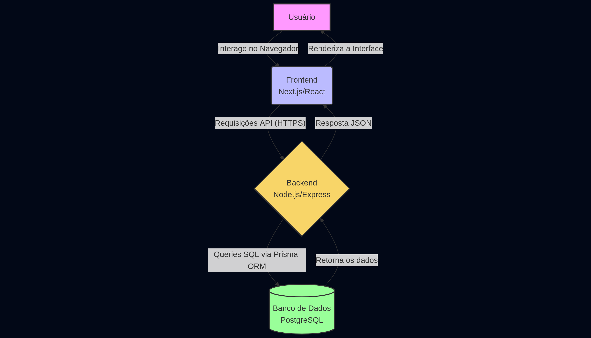

# Arquitetura do Sistema - Adote Fácil

Este documento descreve a arquitetura de software adotada no projeto "Adote Fácil", detalhando os padrões utilizados, a estrutura dos componentes e o fluxo de dados entre eles.

## 1. Modelo Arquitetural Adotado

A arquitetura do "Adote Fácil" pode ser definida como um **Monólito Modular com Frontend Separado**, operando sob o modelo **Cliente-Servidor**.

Vamos entender o que cada termo significa no contexto do projeto:

* **Cliente-Servidor:** descreve a **relação** entre as duas principais partes do sistema. O projeto possui uma aplicação de **Cliente (Frontend)**, que roda no navegador do usuário, e uma aplicação de **Servidor (Backend)**, que centraliza a lógica de negócio. Elas são independentes e se comunicam através de uma API, o que é a essência do modelo Cliente-Servidor.

* **Monólito Modular:** descreve a **estrutura interna** do Backend. Ele é um **Monólito** porque todas as suas funcionalidades (gerenciamento de usuários, animais, chat, etc.) são construídas e implantadas como uma **única aplicação**. No entanto, ele é **Modular** porque seu código é altamente organizado em camadas com responsabilidades distintas, o que o torna manutenível e escalável em termos de desenvolvimento.

Essa abordagem combina a simplicidade de desenvolvimento e implantação de um monólito com a flexibilidade de ter uma interface de usuário desacoplada.

### Componentes Principais

* **Cliente (Frontend):** uma Single-Page Application (SPA) desenvolvida com **Next.js** e **React**. É responsável por toda a experiência e interface do usuário.
* **Servidor (Backend):** uma API RESTful construída com **Node.js**, **Express** e o ORM **Prisma**. Gerencia todas as regras de negócio, autenticação e persistência de dados.
* **Banco de Dados:** um banco de dados relacional **PostgreSQL**, que armazena todas as informações da aplicação.

---

## 2. Diagrama de Componentes (Alto Nível)

O diagrama a seguir ilustra a visão macro da arquitetura, mostrando o Cliente, o Servidor Monolítico e o Banco de Dados, bem como o fluxo de interação entre eles.



O código-fonte para este diagrama foi gerado com o auxílio da IA Gemini e pode ser visualizado ou editado em ferramentas como o [Mermaid Live Editor](https://mermaid.live).

<details>
<summary>Clique para ver o código Mermaid do diagrama</summary>

```
%% Diagrama de Alto Nível - Adote Fácil
graph TD;
    style A fill:#f9f,stroke:#333,stroke-width:2px
    style B fill:#bbf,stroke:#333,stroke-width:2px
    style C fill:#f8d568,stroke:#333,stroke-width:2px
    style D fill:#9f9,stroke:#333,stroke-width:2px

    A[Usuário] -->|"Interage no Navegador"| B(Frontend <br> Next.js/React);
    B -->|"Requisições API (HTTPS)"| C{Backend <br> Node.js/Express};
    C -->|"Queries SQL via Prisma ORM"| D[(Banco de Dados <br> PostgreSQL)];
    D -->|"Retorna os dados"| C;
    C -->|"Resposta JSON"| B;
    B -->|"Renderiza a Interface"| A;
```
</details>
